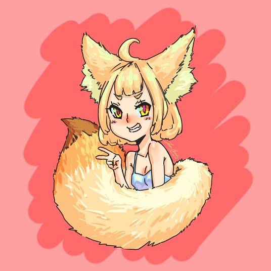

# 关于 @JuerGenie

<h5 style="text-align: center;">你好，我是 JuerGenie Whang, 你也可以叫我 JG 或者 Juer，还可以叫我王玉。</h5>

---

#### 我是个开发者

- 使用的语言

  > 用的更多的是 `Typescript` 和 `HTML` + `CSS`，因为我目前作为一名前端开发者。

  - `Java`
    
    - `Spring-Boot`
    - `JavaFX`
    - `GraalVM`
      我喜欢这个 :)
  - `Kotlin`
    和 `Spring` 一起用，在我的项目中用于替换 `Java`。
    
    - `Spring-Boot`
    - `Ktor`
    - `Ktorm`
    - `Gradle`
    - `Native`
  - `Golang`
  - `Javascript`
    和 `HTML` + `CSS` 一起用。
    
    - `node.js`
    - `Electron`
    - `Vue` 和 `Vue-Next`
    - `React`
    - `Vanilla`
    - `Web Components`
      我超喜欢这个的！
    - `Houdini APIs`
      还有这个！
  - `Typescript`
    用于替换项目中的 `Javascript`
    
    - `deno`
      如果我能很轻松的集成进我的 `Native` 项目就更好了，可以很轻松的构建灵活而又安全的动态插件。
    - `Cocos Creator`
  - `C`
    \*老了，但还没过时*（州长脸）
  - `C++`
    
    - `C++ 2020`
      **现代化** !
  - `Python`
    
    - `Django`
    - `Flask`
  - `GodotScript`
    
    - `Gotod Engine`
    
      `godot 4.0` 什么时候发布啊…

#### 也是个业余画手和业余写手

最上面那张就是我自己画的 `avatar`😀。

其实我真的有想过把 `Github` 当作免费画廊和小说发布页，不过最后还是作罢了（因为我的画不够好看，写的小说也不够有趣），也许以后会尝试一下呢？

---

> 这份文件使用 `Typora` 编辑，`Typora` 超好用的 ♥♥♥
>
> 与我联系：[📧E-Mail](mailto:juergenie@qq.com)
